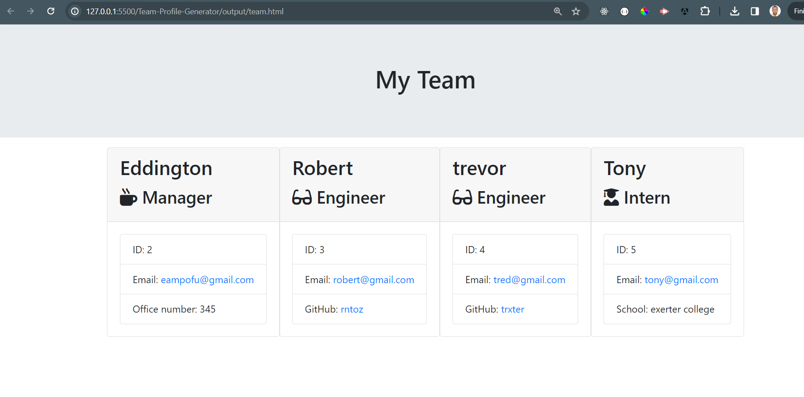
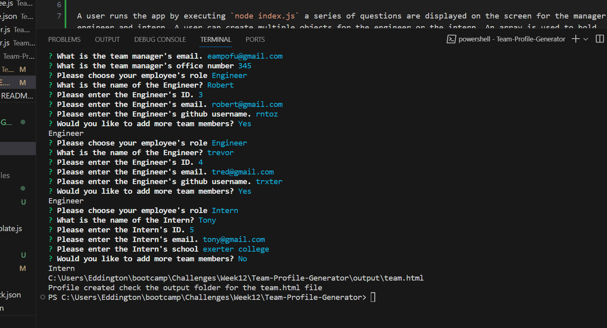

# Team-Profile-Generator
# Description
This is an application that uses node.js to generate a Team profile html file using Object oriented programming (OOP).It makes use of the inquirer package to prompt questions and the jest package to perform Unit testing each class.

## How it works

A user runs the app by executing `node index.js` a series of questions are displayed on the screen for the manager, engineer and intern. A user can create multiple objects for the engineer or the intern. An array is used to hold the objects and later passed to the function that generates the html file and creates the output folder if it does not exist and puts the file in there.

# Screenshots
## final output

## prompts with response

## License

Please see original GitHub repository.